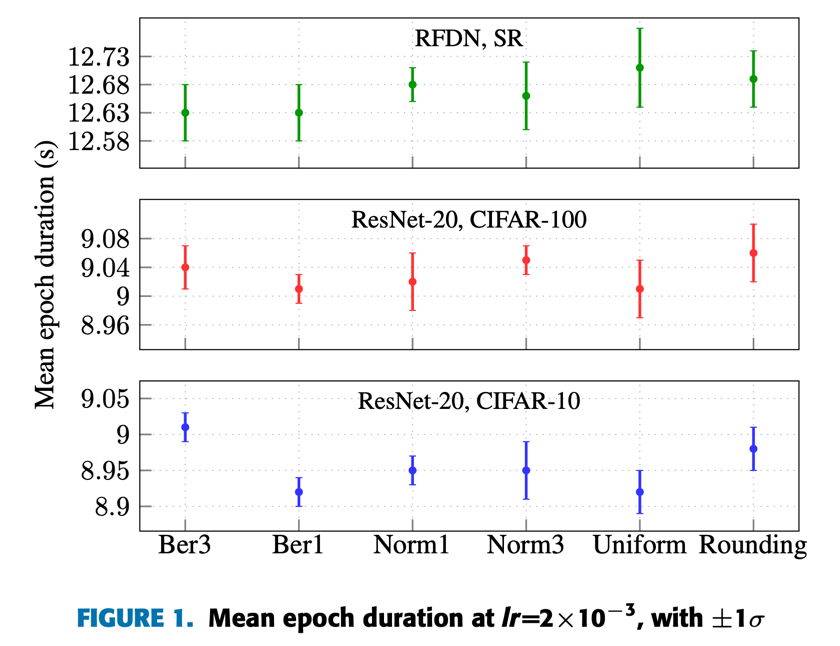
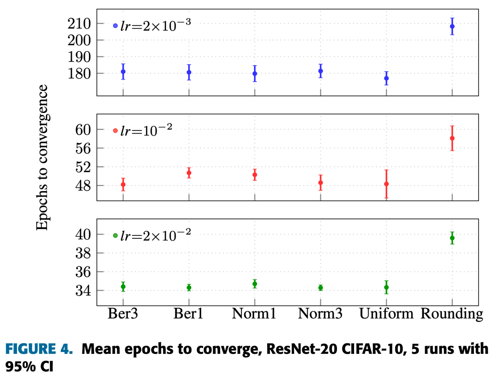
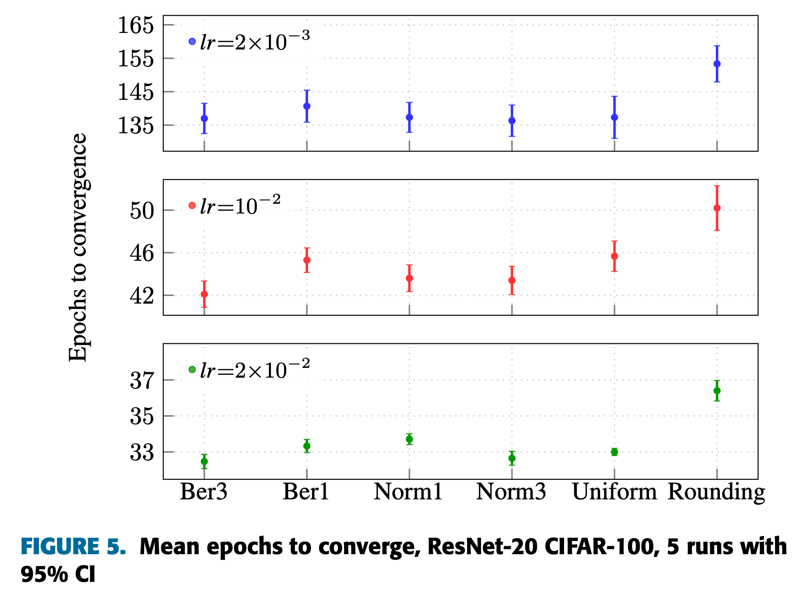
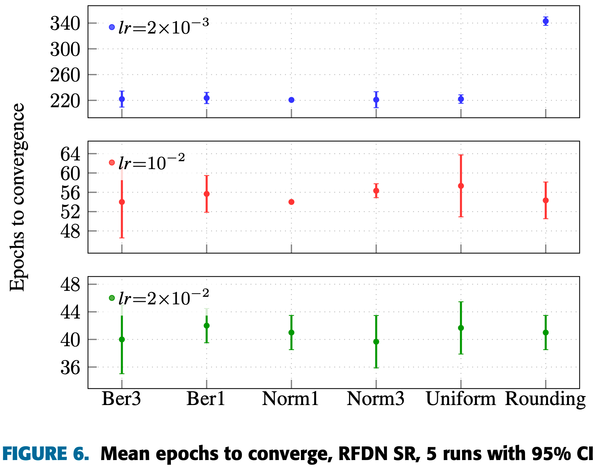
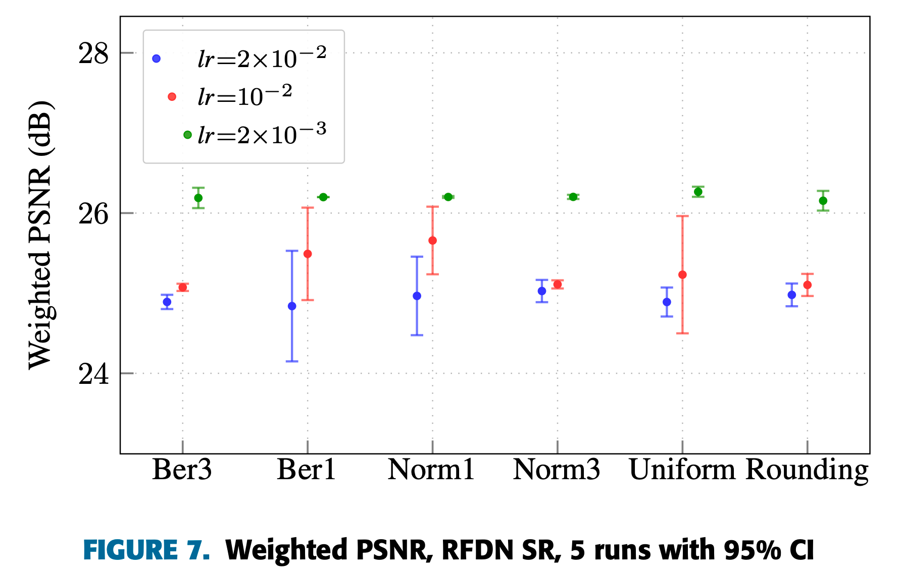

# Experiments Summary

## Mean epoch duration

## ResNet20 on CIFAR-10: mean epochs to convergence

## ResNet20 on CIFAR-100: mean epochs to convergence

## RFDN on SR standard bench: mean epochs to convergence

## RFDN on SR standard bench: weighted PSNR

